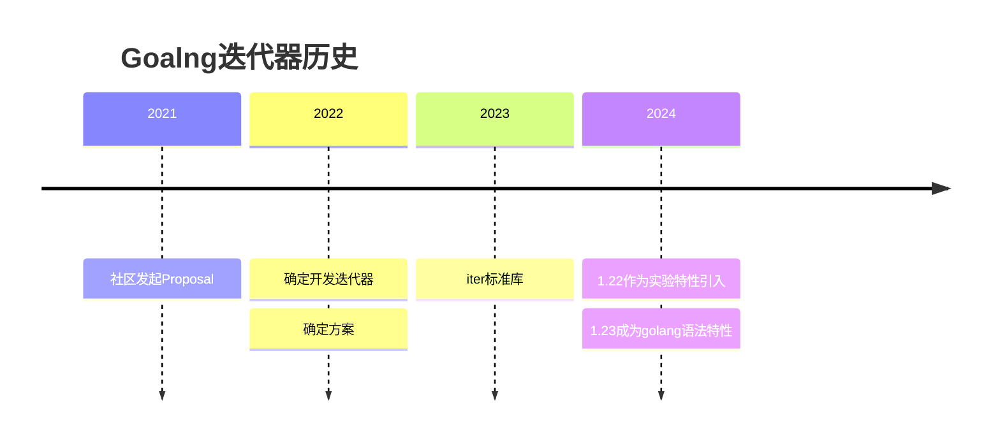

---
theme: smartblue
---
先讲点迭代器的历史，如果不感兴趣直接跳转到用法的讲解。

迭代器早在1.22版本时已经作为实验特性引入，将在2024年8月的1.23正式成为Golang的语法特性。回顾迭代器的历史：



相关文章和讨论：

> - 社区发起的Proposal：https://github.com/golang/go/issues/43557
> - 最终确定迭代器的讨论：https://github.com/golang/go/discussions/56413
> - iter标准库的讨论：https://github.com/golang/go/discussions/54245
> - iter标准库Proposal: https://github.com/golang/go/issues/61897
> - Go 迭代器官方wiki: https://tip.golang.org/wiki/RangefuncExperiment
> - 1.23 Release Notes: https://tip.golang.org/doc/go1.23


迭代器是一种常见的设计模式，很多语言都在语法上直接支持。但是Go在引入时确引起了不少的反对声音，主要的观点是认为：
> -  迭代器破坏了Go的简洁涉及哲学: https://itnext.io/go-evolves-in-the-wrong-direction-7dfda8a1a620
> -  Go的迭代器设计有些复杂，增加了代码复杂度，代码阅读起来比较困难: https://www.gingerbill.org/article/2024/06/17/go-iterator-design/


针对这些问题，我个人的看法是迭代器的引入还是利大于弊，因为：
> 
>    - 迭代器可以帮助我们隐藏内部的复杂结构，不需要将内部结构暴露出来。
>    - 遍历的需求不只有slice、chan、map这些，还有我们自己定义的树、集合等其他结构，在便利的时候也有控制输出顺序的需求。
>    - 可以在遍历的时候控制输出的顺序。
>    - 迭代器的需求真实存在，官方不支持也一样会有第三方的库来支持，就会有五花八门的实现，更会恶化可读性。就像泛型的引入，大家统一使用相同的实现，再去阅读开源代码的时候就不会看到各种奇奇怪怪的实现，放在更宏观的角度，统一的官方实现对代码可读性更友好。

*至于具体的是利是弊也是见仁见智，就不过多涉及这些了。Go一直是向下兼容，所以迭代器的特性如果正式发布，那么后续的版本基本上就不会再剔除这个特性，所以还是需要有必要了解一下它，可以不喜欢不使用，但是要能阅读懂别人的代码。*

接下来就介绍一下主要内容，会分为两大部分：
1. **Go迭代器的定义和基本用法，主要通过示例的方式。**
2. **Go迭代器的真实应用场景，也包括在没有迭代器的时候，一般是如何实现的。**

# 1. Go迭代器的基本用法
官方文档： https://tip.golang.org/wiki/RangefuncExperiment

示例代码： https://github.com/jin06/examples/blob/main/go1.23NewFeature/range/basic/range.go
### 1.1 定义

在标准库iter中关于迭代器的定义：

```go
package iter

type Seq0 func(yield func() bool) bool
type Seq[V any] func(yield func(V) bool) bool
type Seq2[K, V any] func(yield func(K, V) bool) bool

```
其中
- K为for range时返回的key的数据类型
- V为for range时返回的value的数据类型
- yield函数为for range 是迭代器传递key，value给循环的回调函数

这样的定义最初看起来确实比较复杂，也不是特别友好，我建议直接查看使用示例，然后在看完示例后，我尝试去解释一下整个迭代过程，结合示例能更好的理解为什么这么设计。

### 1.2 返回值为2如何使用
以下示例实现了迭代器f2，main函数中遍历f2,将得到的结果打印到标准输出中。

```golang
package main 

import "fmt"

func f2(yield func(int, string) bool) {
    for i := 0; i < 10; i++ {
        if !yield(i, fmt.Sprintf("I'm %d ", i)) {
            return
        }
    }
}
func main() {
    for k, v := range f2 {
        fmt.Println(k, v)
    }
}
```
### 1.3 返回值为1如何使用

和1.2类似，不同点在于for range遍历接收值只有k。

```golang
package main 

import "fmt"

func f1(yield func(int) bool) {
    for i := 0; i < 10; i++ {
        if !yield(i) {
            return
        }
    }
}

func main() {
    for k := range f1 {
        fmt.Println(k, v)
    }
}
```
### 1.4 返回值为0如何使用
和1.2类似，不同点在于for range遍历没有接收值。

```golang
package main 

import "fmt"

func f1(yield func() bool) {
    for i := 0; i < 10; i++ {
        if !yield() {
            return
        }
    }
}

func main() {
    for range f0 {
        fmt.Println("1")
    }
}
```

### 1.5 迭代器如何接受break
以下示例，实现返回k,v的迭代器f2

main函数中遍历迭代器f2，打印遍历到的v

每次迭代判断k，如果k==7退出循环（调用break）
```golang
package main

import "fmt"

func f2(yield func(int, string) bool) {
    for i := 0; i < 10; i++ {
        if !yield(i, fmt.Sprintf("I'm %d ", i)) {
            fmt.Println("ok break")
            return
        }
    }
}

func main() {
    for k, v := range f2 {
        if k == 7 {
            fmt.Println("go break")
            break
        }
        fmt.Println(v)
    }
}
```
### 1.6 迭代过程
我做了一张图，阐释迭代过程中关键节点，如下：


***理解其中yield函数的作用***
- yield每调用一次对应的for range每次循环的开始
- yield调用时传递的参数，就是for range 每次循环返回的k,v数据
- for range 每次循环结束时如果调用了break，yield返回false，否则返回true
- 也可以这么理解，迭代器是将数据主动推送给for range，yield就是那个回调函数

# 2. Go迭代器的真实应用场景
### 2.1 遍历一个跳表
完整的示例代码：https://github.com/jin06/examples/blob/main/go1.23NewFeature/range/skip/skip.go

先假设这样的背景：
> 有一个服务做类似排名的，用了跳表。跳表在有序表的插入和检索时间复杂度的平衡，比较适合写多读也多的场景。
> 然后现在需要对跳表进行遍历，我们只需要增加一个闭包函数就可以实现。

我在github上找到了一个跳表项目，然后直接使用，实现的功能是实现跳表的遍历，按照从小到大的顺序：
-  其中f2()函数是我实现的迭代器
-  main函数先生成跳表，然后遍历跳表
```golang
package main

import (
	"fmt"

	"github.com/MauriceGit/skiplist"
)

type Element int

// Implement the interface used in skiplist
func (e Element) ExtractKey() float64 {
	return float64(e)
}
func (e Element) String() string {
	return fmt.Sprintf("%03d", e)
}

type iterator struct {
	skiplist.SkipList
}

func (iter *iterator) f2(yield func(float64, string) bool) {
	last := iter.GetSmallestNode()
	for i := 0; i < iter.GetNodeCount(); i++ {
		if !yield(last.GetValue().ExtractKey(), last.GetValue().String()) {
			return
		}
		last = iter.Next(last)
	}
}

func main() {
	list := iterator{skiplist.New()}
	list.Insert(Element(101))
	list.Insert(Element(3))
	list.Insert(Element(19))
	list.Insert(Element(4))
	list.Insert(Element(89))

	for k, v := range list.f2 {
		fmt.Println(k, v)
	}
}

```

### 2.2 没有迭代器的时候如何复用代码
完整的示例代码：https://github.com/jin06/examples/blob/main/go1.23NewFeature/range/refrector/main.go

假设需要遍历一个结构体，然后处理返回值并写入到新的结构体中。（这里遍历一个数组，然后加1）

在示例中，分别通过使用传入闭包的方式和使用for range的方式实现。
通过这个例子我们能够发现，使用传入闭包方式虽然可以实现类似功能，但是闭包在Iterator函数中能够实现的逻辑需要提前确定，只能在特定的位置发生。

个人认为闭包的可读性一般是比较差的，不如直接使用结构体。

```golang
package main

type Q struct {
	cids []int
}

func (q *Q) Iterator(f func(cid int)) {
	for _, id := range q.cids {
		f(id)
	}
}

func (q *Q) f2(yield func(int, int) bool) {
	for k, v := range q.cids {
		if !yield(k, v) {
			return
		}
	}
}
func main() {
	q := Q{cids: make([]int, 0)}
	for i := 0; i < 10; i++ {
		q.cids = append(q.cids, i)
	}

	res1 := make([]int, 0)
	q.Iterator(func(cid int) {
		res1 = append(res1, cid+1)
	})

	for _, cid := range q.f2 {
		res1 = append(res1, cid+1)
	}
        fmt.Println("res1: ", res1)
	fmt.Println("res2: ", res2)

}

```

### 2.3 我自己写的一个示例
完整的示例代码： https://github.com/jin06/examples/blob/main/go1.23NewFeature/range/hr/hr.go

实现这样的功能：
> - 查找公司的优秀员工，员工的基础信息被人事部门管理。
> - 三个结构体分别是
>   - HRDept -> 人事部
>   - TeckDept -> 技术部
>   - FinaceDept -> 财务部
> - 人事部有一个迭代器，返回人事部认可的有序员工
> - 在人事部的基础上， 技术部和财务部也有对有序员工的认定标准
> - main函数中通过人事部迭代器，技术部和财务部获取有序员工，再根据自己的标准筛选有序员工


```golang
package main

import (
	"fmt"
	"math/rand"
	"unicode/utf8"
)

var (
	eHRDept     *HRDept
	eTeckDept   *TeckDept
	eFinaceDept *FinaceDept
)

func randomName() string {
	buf := make([]byte, utf8.UTFMax)
	for i := 0; i < 5; i++ {
		buf = append(buf, byte(rand.Intn(24)+int('a')))
	}
	return string(buf)
}

func init() {
	eHRDept = &HRDept{
		Employees: make([]*Employee, 0),
	}
	for i := 0; i < 100; i++ {
		eHRDept.Employees = append(eHRDept.Employees, &Employee{
			No:          10000 + i,
			Name:        randomName(),
			Performance: rand.Intn(100),
			Skill:       rand.Intn(100),
			Salary:      rand.Intn(100),
		})
	}
	eTeckDept = &TeckDept{eHRDept}
	eFinaceDept = &FinaceDept{eHRDept}
}

type Employee struct {
	No          int
	Name        string
	Performance int // 0 - 100
	Skill       int // 0 - 100
	Salary      int // 0 - 100
}

type HRDept struct {
	Employees []*Employee
}

func (hr *HRDept) GoodEmployeesRange(yield func(*Employee) bool) {
	for _, e := range hr.Employees {
		if e.Performance > 80 {
			if !yield(e) {
				return
			}
		}
	}
}

type TeckDept struct {
	*HRDept
}

func (dept *TeckDept) GoodEmployees() {
	for e := range dept.GoodEmployeesRange {
		if e.Skill > 80 {
			fmt.Println("teck good employee:", e.Name)
		}
	}
}

type FinaceDept struct {
	*HRDept
}

func (dept *FinaceDept) GoodEmployees() {
	for e := range dept.GoodEmployeesRange {
		if e.Salary < 20 {
			fmt.Println("finace good employee: ", e.Name)
		}
	}
}

func main() {
	fmt.Println("Test employee example")
	eTeckDept.GoodEmployees()
	eFinaceDept.GoodEmployees()
}
```