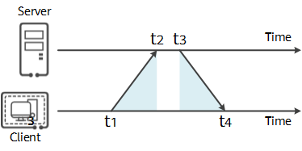
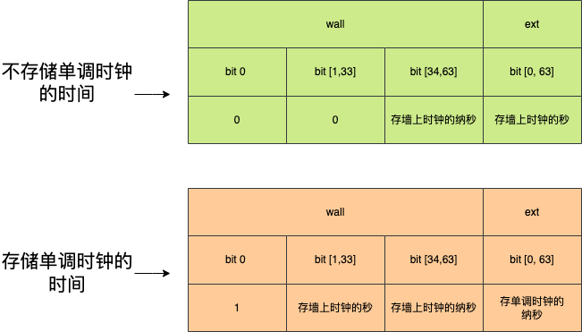
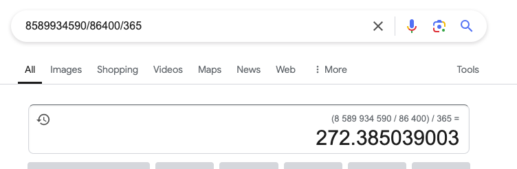

### 什么是时间?
时间的定义：

> 时间（英语：time）是一种尺度，在物理定义是标量，借着时间，事件发生之先后可以按过去-现在-未来之序列得以确定（时间点/时刻，point in time/instant），
> 也可以衡量事件持续的期间以及事件之间和间隔长短（时间段，duration）

关于时间的问题，有两个概念最为关键，时刻和时间段。时刻和时间段都是如何衡量是比较重要的。时间的概念是抽象的，一般是根据现实世界中的某些物理运动结合。比如现在的天的概念就是通过观察地球自转来确定。

在古代不需要对于时间做出精确的计算，一般的计时方式就是通过地球自转确定一天，然后通过太阳光线的变化来确定一天当中的时辰。

这种确定时间的方式称为`太阳钟`。

然后再利用机械原理发明钟表，就可以确定一天当中的具体时分秒，然后隔一段时间对时一下就好了。(当然日冕也属于钟表)
cati

地球自转的相对时间受到地震、潮汐等影响，并不是确定的86400秒。现在每天比86400秒少1毫秒到2毫秒左右。这是`太阳钟`的问题，没有办法确定精确的时间。

在古代这并不是什么太大的问题，但是在现代，确定精确时间和时间段就比较关键。

现代的物理学的发展，已经可以解决精确时间的问题，通过以`铯`原子基态的两个超精细能级间跃迁对应的辐射的9,192,631,770个周期的持续时间为标准，确定1秒钟。按照这种方式，1亿年也不差1秒。这就是`原子时`。

那么使用`原子时`计时，然后再确定一个起始时间点，那么就可以有精确的时间了。但是人类使用`太阳时`已经几千年，人们还是习惯于按照自然的天来计算时间。使用`原子钟`时间久了会导致时间和太阳自转的脱节，例如自转一直变快，可能很久之后时间变成了中午12点才出太阳。

因为这个原因，所以不能直接采用`原子时`。

实际上`原子钟`就是一种时钟，精度无限趋近于实际的钟表。人类活动使用的是`太阳钟`，现在计算机中具体使用的其实是`原子钟`,那么`原子钟`和`太阳钟`之间产生了差距时，就需要进行对时。对时一般是以走的准的时钟为主，像我们小的时候，手表隔一段时间需要和广播和电视上的时间对时。

所以引入了`润秒`的感念，`润秒`就是为了来调时钟的，当`原子钟`的时间和`太阳钟`的时间差距在1秒以上时就插入个润秒,基本上每隔几年会增加一个润。添加润秒会提前发布公告，一般如果需要添加`润秒`会在当年的6月或12月的最后一天。

只需要知道`润秒`是为了调节`原子钟`和`太阳钟`一致就可以了。在计算机钟，`润秒`的解决方案导致了非常多的bug，而且目前测算，100年的时间`太阳钟`和`原子钟`之间也只有1分钟的差距，1万年也就2小时。为了这样的差距，我觉得没有必要去调表。实际上已经提出了废除润表的提案，在2035年正式废除`润秒`。实际上，即便不调表，一直使用原子钟，一个人一辈子每天感受到的时间其实也是一致的，一千年以后的人也和现在的感觉差不了太多，就算到了10万年以后，那时候的人他们经历的一生也都是一致的，不会有什么太大的变化。他们每天12点出太阳，从出生到死亡都是每天12点出太阳，对生活有什么影响。

### 计算机中如何处理时间

计算机对于时间精度的要求很高，计算机内部有时钟芯片来计时，计时所谓的本地时间，但是计算机本地事件和标准时间存在偏差，所以需要定时和标准时间同步。

计算机本地时间同步标准时间的协议就是NTP(Network Time Protocol),网络时间协议。简单来说：
 - 有一个机构同步了世界上所有的原子钟的时间，然后算出世界的标准时间。
 - 世界标准时间通过网络分发给世界上的所有的时间服务器。
 - 世界上所有的计算机通过NTP协议与这些时间服务器同步时间，校准本地时间：
    - 时间同步时有网络延迟的影响，NTP协议已经考虑到。（细节不讨论），我觉得这个图基本能说明了它是如何处理网络延迟的问题。
    
    - 计算机NTP客户端同步到标准时间后如何校准本地时间呢？
      - 第一种，直接调整。这种不用解释，直接调整成和标准时间一样。
      - 第二种，步进调整。比如本地时间比标准时间快了1分钟，那我就把本地时间的钟表（芯片实现的）给调慢了，然后经历一整天和标准时间一致。

关于NTP调整本地时间的两种策略，都有问题。第一种直接调整就有可能产生时钟回拨的问题，如果程序的逻辑依赖于时间顺序，比如计算时间流逝，监控采集等就会负值，这样就产生了严重的错误。实际上确实有基于时钟时间的耗时计算导致严重bug的问题大量存在。第二种，步进调整也有问题，那意味着时间缓慢调整的过程中，我的时间计算都存在误差。如果和标准时间存在较大的差距，那问题就更严重。而且如果我们使用时钟来计算时间间隔，那么定时任务的周期也是不准确的。

为了解决时间校准时的问题，计算机又产生了一个新的概念，`单调时钟`。顾名思义，`单调时钟`就是一直增长不会下降。单调时钟要解决的问题就是时间段的计算问题，比如计算时间间隔问题。开始时记录一个单调时间，结束时记录另一个单调时间，这两个时间的差值就是时间间隔，由于单调时间不受时钟调整的影响，所以使用单调时间记录时间间隔是最准确的。

比如Linux中的CLOCK_REALTIME，CLOCK_MONOTONIC。
CLOCK_MONOTONIC。这个就是单调时间，由系统启动时确定一个基准时间，然后一直往上加，不受NTP协议校准时间的影响。为了区分单调时钟，将原有的系统时间称为`墙上时钟`

时间校准时还有一个`润秒`忘了说了。`润秒`的概念和NTP有点类似，但是和NTP又完全没关系，算了，先忘了NTP吧。

由于原子钟计时和太阳钟的不同，世界标准时间是基于原子钟计时的，但是如果和太阳钟差距超过1秒时，就需要对时间进行调整了。UTC是我们现在使用的世界标准时间，校准的就是这个时间，校准的方式就是增加或者减少一个`润秒`。
润秒的调整就是各个操作系统来解决了，比如Linux的处理流程：
- 收到调整润秒的通知（由网络获取，一般是提前几天收到）
- 当需要插入润秒时根据策略完成，策略可选，策略由几种
  - 直接忽略
  - 直接调整，可能向前调整1秒或者回拨1秒
  - 步进调整。和NTP的步进调整差不多。

实际上NTP和`润秒`都会时间的校准，NTP是和标准时间不同导致的，润秒是由于标准时间和太阳时不同导致的。但是给计算机造成的问题都是一样的，要么时钟往前调，要么往回拨，要么时间变慢，要么时间变快。这些都是计算机需要解决的问题，或者是程序员需要了解的问题，编程时心里有数。


### Go中的时间

#### Go语言中时间结构体：src/time/time.go

```go
type Time struct {
	// wall and ext encode the wall time seconds, wall time nanoseconds,
	// and optional monotonic clock reading in nanoseconds.
	//
	// From high to low bit position, wall encodes a 1-bit flag (hasMonotonic),
	// a 33-bit seconds field, and a 30-bit wall time nanoseconds field.
	// The nanoseconds field is in the range [0, 999999999].
	// If the hasMonotonic bit is 0, then the 33-bit field must be zero
	// and the full signed 64-bit wall seconds since Jan 1 year 1 is stored in ext.
	// If the hasMonotonic bit is 1, then the 33-bit field holds a 33-bit
	// unsigned wall seconds since Jan 1 year 1885, and ext holds a
	// signed 64-bit monotonic clock reading, nanoseconds since process start.
	wall uint64
	ext  int64

	// loc specifies the Location that should be used to
	// determine the minute, hour, month, day, and year
	// that correspond to this Time.
	// The nil location means UTC.
	// All UTC times are represented with loc==nil, never loc==&utcLoc.
	loc *Location
}
```

首先要讲一下什么是墙上时钟，墙上时钟就可以理解为计算机的时钟，需要和时间服务器对时的，就是我们经常使用的时间的时钟，为了区分单调时钟，计算机就叫墙上时钟。这几个字段的解释：
- wall 表示墙上时钟，也就是系统的本地时间，UTC时间
- ext 扩展字段，配合wall一起表示墙上时钟和单调时钟
- loc 表示的是时间的时区

看一下wall和ext的每一位的含义，以及它如何表示时间，这里画了一个小图，解释一下go使用wall和ext这两个字段如何存储墙上时钟和单调时钟，wall和ext首先都是64位，也就是8个字节，看一看每一位存储了什么信息：



- wall第一个bit位表示这个时间结构体有没有存储单调时间：
	- 如果为0，表示不存储单调时间
	- 如果为1，表示存储了单调时间
- wall的34到63bit位固定存储墙上时钟的纳秒
- wall存储墙上时钟的秒，或者什么也不存储
- ext存储单调时间（纳秒级别）或者墙上时钟的秒

这个设计是一种平衡，因为：
- Go的时间标准库不使用动态空间去存储时间，使用固定的字段存储时间，就会导致时间有一定表示范围，不是无限的。
- Go的时间精度达到纳秒
- Go的时间中保存了墙上时钟和单调时钟两个时间

墙上时钟是一直存储的，那什么时候存储单调时钟呢？就是Time结构体有多余空间的时候，当wall字段存储的秒数超过32位时，就会把秒数存储到ext字段，那此时就不存储单调时钟了。如果存储的时间超过64位能表示的，那就溢出了，Go的时间结构体不能表示这么大的时间，如果需要表示这么大的时间需要开发者字节去实现一个更大的存储空间的字段来实现。

Go中的时间从January 1, year 1, 00:00:00 UTC 开始的，1885年到2157年这段常用的年份,存储单调时间，其他时间不存储单调时钟的时间。(33位可以存储的最大值8589934590)，可以存272年的数据。



#### Go语言中时区结构体：src/time/zoneinfo.go

Location 结构体用来表示地理区域的时间信息，时区。主要包含了时区的偏移量，时区规则（夏令时转换规则），这些信息在时间处理成其他时间显示时需要使用到。
```go
type Location struct {
	name string
	zone []zone
	tx   []zoneTrans

	// The tzdata information can be followed by a string that describes
	// how to handle DST transitions not recorded in zoneTrans.
	// The format is the TZ environment variable without a colon; see
	// https://pubs.opengroup.org/onlinepubs/9699919799/basedefs/V1_chap08.html.
	// Example string, for America/Los_Angeles: PST8PDT,M3.2.0,M11.1.0
	extend string

	// Most lookups will be for the current time.
	// To avoid the binary search through tx, keep a
	// static one-element cache that gives the correct
	// zone for the time when the Location was created.
	// if cacheStart <= t < cacheEnd,
	// lookup can return cacheZone.
	// The units for cacheStart and cacheEnd are seconds
	// since January 1, 1970 UTC, to match the argument
	// to lookup.
	cacheStart int64
	cacheEnd   int64
	cacheZone  *zone
}

```

#### Go语言中的Duration

Duration 64位存储，最小可以表示1ns的时间段。

```go
type Duration int64
const (
	Nanosecond  Duration = 1
	Microsecond          = 1000 * Nanosecond
	Millisecond          = 1000 * Microsecond
	Second               = 1000 * Millisecond
	Minute               = 60 * Second
	Hour                 = 60 * Minute
)
```

#### Go语言中的一些函数

- time.Now()
	- 调用runtime的time_now()函数，和硬件有关，不同的操作系统实现方式不一样
		- 例如linux amd64使用汇编，获取真实时间和单调时钟
- time.Since()
	- 这个函数使用的是单调时钟的函数。在旧版本 Go < 1.9使用的是墙上时钟，正如上面讲的。墙上时钟存在时钟回拨问题，这会导致bug，一个实际的例子是 Cloudflare 在 2016 年的润秒事件中出现的 DNS 中断问题。 
